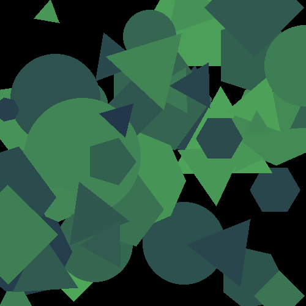

# RBGen - Random Background Generator

A tool for applying simple randomly generated backgrounds to transparent images.
Replaces the transparent areas of the image with a solid color while preserving the original non-transparent content. 

## Features

- Multiple background types:
  - Solid color
  - Striped patterns
  - Checkered patterns
  - Fractals
  - Geometric shapes
  - Lines
  - Textures (Perlin noise, gradient, marble, clouds)
- Smart color selection:
  - Color theory-based pairs (complementary, analogous, triadic, etc.)
  - Predefined palettes for various themes
  - Weighted color selection for natural-looking results
- Batch processing of multiple images
- Customizable or fully random generation

## Installation

```bash
# Clone the repository
git clone https://github.com/spa-dev/rbgen.git
cd rbgen

# Install dependencies
pip install -r requirements.txt
```

## Usage

```bash
# Basic usage (random backgrounds)
python -m rbgen.main -i input_folder -o output_folder -r

# Use a specific background mode
python -m rbgen.main -i input_folder -o output_folder -m gradient

# Use a specific color theme
python -m rbgen.main -i input_folder -o output_folder -t forest

# List all available background modes
python -m rbgen.main --list-modes

# List all available color themes
python -m rbgen.main --list-themes
```

## Examples

Below are example images generated using different background modes in rbgen.
To use a specific mode, specify it in the command-line arguments or use a random selection.

<table>
<tr>
<td><b>Line</b></td>
<td><b>Striped</b></td>
<td><b>Checkered</b></td>
</tr>
<tr>
<td></td>
<td></td>
<td></td>
</tr>
<tr>
<td><b>Perspective Checkered</b></td>
<td><b>Mandelbrot</b></td>
<td><b>Nested Polygons</b></td>
</tr>
<tr>
<td></td>
<td></td>
<td></td>
</tr>
<tr>
<td><b>Geometric Shapes</b></td>
<td><b>Concentric Shapes</b></td>
<td><b>Wavy Line</b></td>
</tr>
<tr>
<td></td>
<td></td>
<td></td>
</tr>
<tr>
<td><b>Perlin Noise</b></td>
<td><b>Gradient</b></td>
<td><b>Radial Pattern</b></td>
</tr>
<tr>
<td></td>
<td></td>
<td></td>
</tr>
<tr>
<td><b>Marble</b></td>
<td><b>Cloud</b></td>
<td><b>Waves</b></td>
</tr>
<tr>
<td></td>
<td></td>
<td></td>
</tr>
</table>

## Limitations

Currently limited to a choice of only two base colors in the background.

## Directory structure

```
background-generator/
├── src/
│   ├── rbgen/
│   │   ├── __init__.py
│   │   ├── backgrounds/
│   │   ├── color_schemes/
│   │   ├── processing/
│   │   └── main.py
├── docs/ # example images only
│── tests/
├── setup.py
├── requirements.txt
└── README.md
```

## Contributing

Contributions are welcome! Please feel free to submit a pull request.

## License

MIT License - Free to use and modify.
